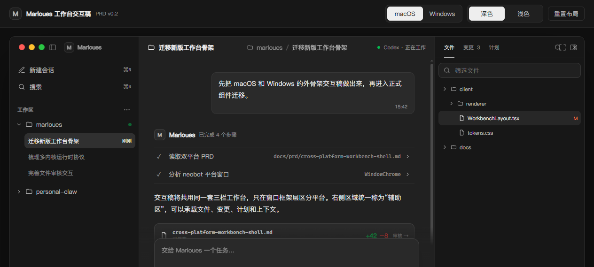
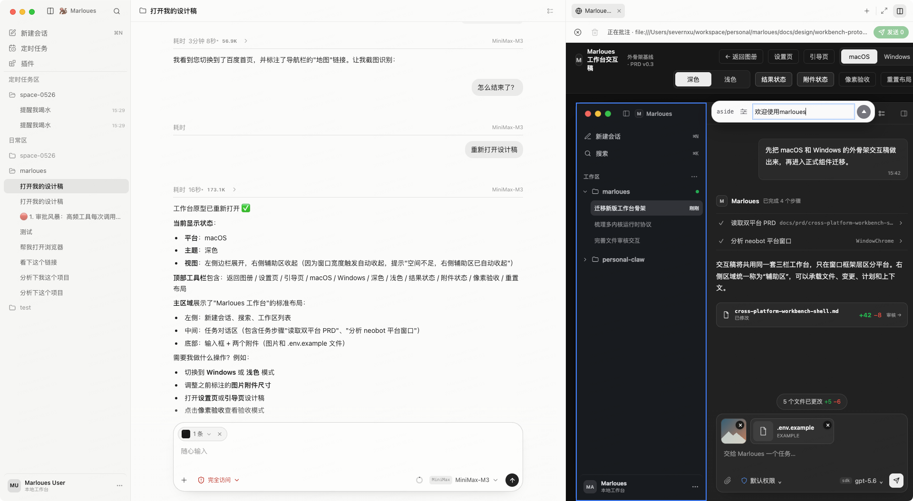
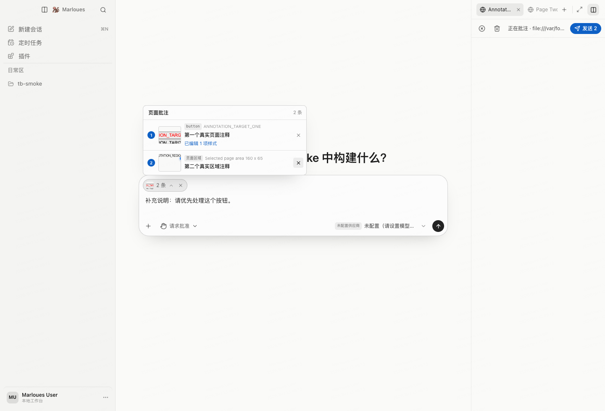
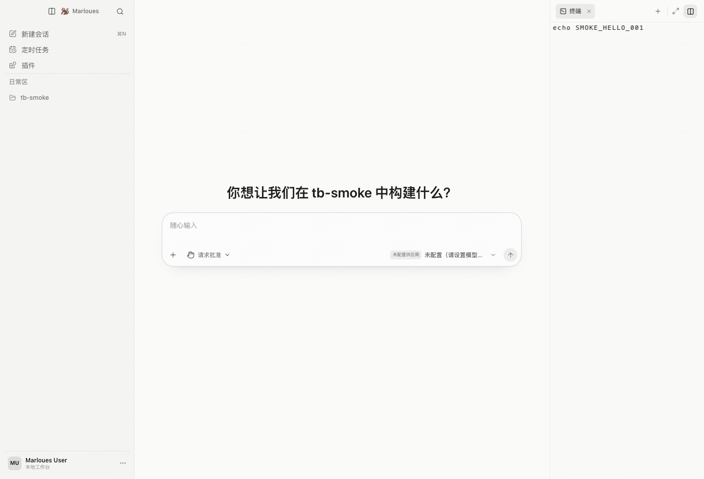
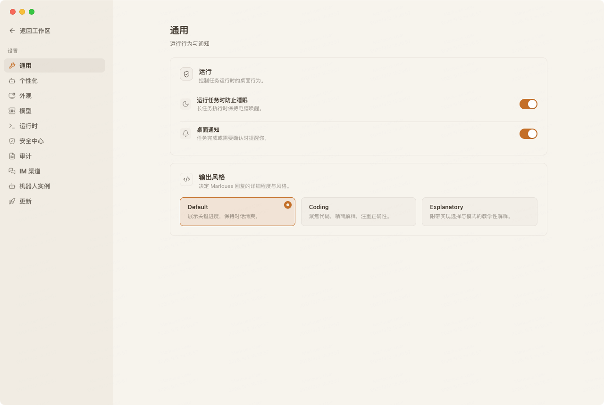

<p align="center">
  
</p>

<h1 align="center">Marloues</h1>

Marloues 是面向本地工作区与企业环境的多运行时 Agent 桌面工作台。它把对话、文件、浏览器、终端、任务执行和安全审批放在同一套 Electron 应用中，让 Agent 可以在受控边界内完成从理解上下文到执行和验证的完整工作流。

## 界面预览

### 一体化 Agent 工作台

会话、工作区、Agent 执行过程、文件变更与任务计划集中在同一个桌面工作区。



### 对话、浏览器与设计上下文并行协作

Agent 对话与浏览器批注可同时打开：一边阅读和处理任务，一边在网页或设计稿中标注内容、附加文件并把上下文交回当前会话。



### 浏览器批注，沉淀为任务上下文

在辅助侧边栏中对网页内容添加批注，并将选区、批注和补充说明作为结构化上下文发送给 Agent。



### 集成终端与实时反馈

在同一辅助侧边栏中运行受控终端命令，保留输出与多标签终端状态，无需离开当前任务。



### 完整的应用设置

设置页覆盖运行行为、个性化、外观、模型端点、运行时、安全中心、审计、IM 渠道、机器人实例和更新配置。



> 工作台总览图来自交互原型；其余截图来自实际运行的应用或功能冒烟测试。

## 核心能力

### 多运行时 Agent

- **SDK Runtime**：通过 Agent SDK 运行，适用于企业端点和受控交付。
- **Binary Runtime**：调用内置或系统 `PATH` 中的 Codex 二进制，复用现有 Agent 能力。
- **Self-built Runtime**：本地 Agent loop，支持工具注册、任务控制和更细粒度的审计。
- **协议网关**：在 Anthropic、OpenAI Chat Completions 和 OpenAI Responses 协议之间转换，便于接入不同模型端点。

所有运行时共享统一的会话工作流，并按各自能力提供模型选择、权限模式、分支、编辑和中断等操作。

### 面向执行的工作台

- 会话与工作区：创建、搜索、分支、回退、持久化与 Markdown 导出。
- 任务上下文：执行进度、工具调用、最终回复、来源和后台进程集中呈现；支持上下文预算与手动压缩。
- 辅助侧边栏：查看产出、文件、项目记忆和变更审核；内置终端和多标签浏览器。
- 浏览器批注：选取页面内容、添加说明后直接作为任务附件发送给 Agent。
- 工作区检查点：记录文件变更并支持按会话回退。
- 定时任务：支持一次性与 Cron 任务、启停控制和执行记录。

### 扩展与协作

- MCP 服务：支持 `stdio`、HTTP 与 SSE 配置、连通性探测和运行时状态展示。
- Skills：提供本地导入、详情查看和市场式管理入口，并可受企业策略约束。
- IM 渠道：支持飞书与企业微信的双向桥接、流式回复、审批分发和机器人实例配置。
- 端点与模型：在设置中管理模型供应商、协议、端点连通性与可用模型。

### 安全与可审计性

- 权限审批、审批超时与会话级授权跟踪。
- 文件路径边界、命令安全检查和进程沙箱执行策略。
- 导航/网络策略、敏感信息脱敏和诊断信息脱敏。
- 工具调用审计、SQLite 会话状态持久化与系统安全存储的密钥保护。
- 签名 UI 热更新清单与桌面应用自动更新能力。

## 快速开始

**环境要求：** Node.js `>= 22.22.1 < 23`、npm `>= 10 < 11`。建议使用仓库中的 `.nvmrc`。

```bash
nvm use
npm install

# 如需使用内置浏览器，首次安装 Chromium 运行时
npm run --workspace marloues install:playwright-browsers

# 启动 Electron 开发环境
npm run dev
```

SDK Runtime 默认读取 Anthropic 凭据。复制 `.env.example` 为 `.env.local` 并填写所需配置；也可以在应用的“模型”设置中添加和测试兼容端点。

```bash
cp .env.example .env.local
```

## 常用命令

```bash
# 质量检查
npm run lint
npm run typecheck
npm run test:unit
npm run test:contract
npm run build
npm run verify                # 不包含 E2E、打包冒烟和官网构建

# Electron 与功能冒烟
npm run test:e2e              # 先构建；需要图形显示环境
npm run --workspace marloues test:smoke:terminal-browser
npm run package:smoke         # 打包为 unpacked 应用后运行冒烟

# 打包
npm run package:dir
npm run package:mac
npm run package:win
npm run package:linux

# 官网
npm run site:dev
npm run site:build
```

补充说明：

- `npm run test:smoke:runtime` 和 `npm run test:smoke:live-runtime` 需要真实模型凭据和网络。
- `npm run test:e2e`、`npm run test:smoke:terminal-browser` 与 `npm run package:smoke` 需要 Electron 显示环境；Linux CI 使用 `xvfb`。
- `npm run release` 会执行构建并调用发布配置；正式发布所需的签名、更新和 GitHub 凭据由 CI secrets/variables 提供。

## 项目结构

```text
client/                         # Electron 应用包
  main/                         # 主进程：运行时、安全、网关、IM、服务与 IPC
    core/runtime/               # SDK / Binary / Self-built Runtime
    core/security/              # 审批、沙箱、导航与脱敏策略
    gateway/                    # Anthropic / OpenAI 协议转换网关
    im/                         # 飞书、企业微信渠道桥接
    services/                   # 浏览器、终端、MCP、Skills、计划任务、存储等服务
  preload/                      # 主进程与渲染进程的安全桥接
  renderer/                     # React 工作台、设置、会话和辅助面板
  shared/                       # 跨进程契约、运行时类型与工作流模型
  scripts/                      # 构建、热更新、发布辅助脚本
tests/                          # 单元、契约、冒烟、E2E 与视觉检查
docs/                           # 产品、架构、实现、运维与设计文档
  assets/readme/                # README 使用的产品截图
site/                           # Astro 官网
.github/workflows/              # CI、三平台发布与签名热更新 feed
```

## 质量与发布

- 本地 Git Hooks：`pre-commit` 对暂存文件执行 ESLint/Prettier，`pre-push` 执行 lint、类型检查与单元测试。
- CI：校验依赖安全性，运行应用质量门、官网构建、Electron E2E 与打包产物冒烟测试。
- Release：推送 `v*` tag 后分别构建 macOS、Windows、Linux 安装包并发布 GitHub Release。
- Hot Update：工作流可构建并签名 `stable`、`beta`、`nightly` 三个渠道的 UI 更新 feed。

## 文档导航

| 文档 | 内容 |
| --- | --- |
| [产品需求](docs/prd/) | 内网 Agent、工作台与跨平台交互需求 |
| [架构设计](docs/architecture/) | Runtime SPI、三层契约、浏览器/终端集成方案 |
| [实现进度](docs/implementation/) | 分阶段计划、已知限制和测试矩阵 |
| [运维文档](docs/operations/) | 热更新配置与发布操作 |
| [设计文档](docs/design/) | 工作台、设置与引导页设计基线 |

## 贡献与许可

贡献流程与开源许可证尚在整理中。提交前请至少执行与改动范围对应的质量检查；发布相关变更还应验证打包与更新流程。
