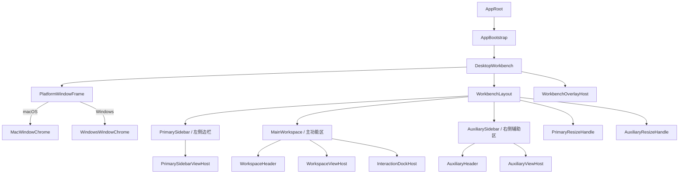

# Marloues 双平台工作台外骨架 PRD

> 版本：v0.3  
> 状态：外骨架像素基线已冻结，待分阶段工程实施  
> 基准：`C:\workspace\neobot` 2026-08-01 当前实现  
> 适用范围：Marloues Desktop / macOS / Windows

交互评审入口：[双平台工作台交互稿](../design/workbench-prototype/index.html)

## 0. 已确认产品决策

确认日期：2026-08-01

1. Windows 保持“关闭主窗口后隐藏到系统托盘”的生命周期语义，只有显式选择“退出 Marloues”才结束应用进程。
2. v1 正式冻结左侧边栏默认宽度 `275px`、右侧辅助区默认宽度 `319px`、双平台顶部区域高度 `46px`。
3. 后续如需调整上述基线，必须更新本 PRD、视觉基线和对应的双平台验收用例，不允许在组件中局部覆盖。
4. 当前阶段只统一外部组件：平台窗口层、三栏容器、两条分栏手柄、顶部轨道、外骨架表面与边界；业务 View 内部样式留到后续逐区审核。
5. “像素级一致”指 Marloues 在同一平台、同一主题、同一状态下与该平台的已审核交互稿一致，不指 macOS 与 Windows 互相绘制成相同窗口。
6. v1 外骨架像素基线只冻结 `dark` 与 `light`。暖色主题保留在产品方向中，但必须经单独视觉评审后才能进入像素门禁。
7. 交互稿的工具栏、画布背景、窗口投影与展示圆角只服务评审陈列，不属于 Renderer 产品 UI，也不得迁入 Electron 客户区。

## 1. 文档目的

本文定义 Marloues 桌面端外骨架在 macOS 与 Windows 上的产品要求。本次不是重新设计 neobot 的窗口体验，而是将其已经验证的双平台模式迁移为 Marloues 的正式规范。

- 共用同一套三栏工作台和业务视图。
- macOS 使用原生窗口框架、交通灯和融合式标题区域。
- Windows 使用无边框窗口和完整的自定义标题栏。
- 平台差异收敛在窗口框架、字体、快捷键、滚动条和系统生命周期语义中。
- 进入业务内容区后，两端的信息架构、功能能力和操作结果保持一致。
- 每个平台分别建立可复现、可截图、可量测的外骨架状态，作为工程实现的唯一视觉参照。

本文与交互稿 v0.3 同步通过后，才能开始外骨架实现；任何工程侧偏差必须先回到本基线处理。

## 2. 产品目标

### 2.1 核心目标

1. 让 Marloues 在 macOS 和 Windows 上分别符合用户熟悉的桌面应用习惯。
2. 保留 neobot 当前双平台窗口模式的结构、密度和交互质感。
3. 建立稳定的三栏插槽，使后续功能组件可以独立增加或替换。
4. 保证平台适配不侵入 Conversation、Settings、Files 等业务组件。
5. 为暗色、亮色主题提供一致的窗口背景和原生控件适配。
6. 让同一状态的实现与交互稿在 CSS 几何、表面颜色、边界归属、控件显隐和层级关系上达到像素级一致。

### 2.2 非目标

- 本阶段不迁移 neobot 的企业 SSO、热更新、水印和会话回放。
- 本阶段不重写聊天 Store、Runtime、IPC 协议和数据库。
- 不创建 `MacWorkbench`、`WindowsWorkbench` 两套业务组件树。
- 不要求 macOS 与 Windows 互相像素相同；两端分别严格匹配各自的平台基线。
- 暂不把 Linux 作为独立视觉规格。
- 本阶段不验收 `PrimarySidebarViewHost`、`WorkspaceViewHost`、`AuxiliaryViewHost` 和 `InteractionDockHost` 内部的业务排版、卡片、树节点、消息、Composer、Steer、权限面板与附件样式。
- 本阶段不冻结暖色主题的视觉值。

## 3. 正式术语与组件命名

### 3.1 三栏术语

| 中文名称   | 组件名             | 职责                               |
| ---------- | ------------------ | ---------------------------------- |
| 左侧边栏   | `PrimarySidebar`   | 工作区、会话、全局入口和用户区域   |
| 主功能区   | `MainWorkspace`    | 聊天、设置、Diff 等当前主要任务    |
| 右侧辅助区 | `AuxiliarySidebar` | 文件、变更、计划、上下文等辅助信息 |

右侧区域不得再命名为 `InspectorPane`。`Inspector` 可以作为右侧辅助区中的一种 View，但不能代表整个区域。

### 3.2 层级命名

| 后缀        | 使用场景                   |
| ----------- | -------------------------- |
| `Root`      | React 应用根节点           |
| `Workbench` | 桌面工作台整体             |
| `Layout`    | 几何布局和响应式策略       |
| `Sidebar`   | 位于主区侧面的可折叠栏     |
| `Workspace` | 当前主要任务区域           |
| `View`      | 连接具体业务状态的功能视图 |
| `Host`      | 跨区域内容或浮层的承载点   |
| `Overlay`   | 位于工作台上方的浮层       |

禁止新增含义不明确的裸 `Shell`、裸 `Frame`、`Parts`、`RightSidebar` 和 `MainFrame`。`PlatformWindowFrame` 是已定义的平台适配边界，不受此限制。

### 3.3 本阶段外部组件边界

| 组件                                            | 本阶段负责                                                                       | 本阶段不负责                         |
| ----------------------------------------------- | -------------------------------------------------------------------------------- | ------------------------------------ |
| `PlatformWindowFrame`                           | 原生窗口配置、Renderer 客户区、平台与主题注入                                    | 会话、文件与 Runtime 业务状态        |
| `MacWindowChrome`                               | 原生交通灯安全区、融合标题轨道、可拖拽区                                         | 自绘交通灯                           |
| `WindowsWindowChrome`                           | 唯一 `46px` 顶部轨道、caption controls、拖拽命中岛                               | 第二条业务标题栏、系统原生标题栏     |
| `WorkbenchLayout`                               | 三栏几何、折叠、Peek、拖拽、辅助区覆盖态                                         | 任一业务 View 的内部排版             |
| `PrimarySidebar`                                | 导航表面、外边界、宽度与 `PrimarySidebarViewHost` 插槽                           | 工作区行、会话行、账户卡内部样式     |
| `MainWorkspace`                                 | 工作表面、`WorkspaceHeader`、`WorkspaceViewHost` 与 `InteractionDockHost` 的边界 | 消息、活动、文件卡与输入交互内部样式 |
| `AuxiliarySidebar`                              | 工作表面、左边界、`AuxiliaryHeader`、`AuxiliaryViewHost` 与覆盖态                | 文件树、变更列表、计划列表内部样式   |
| `PrimaryResizeHandle` / `AuxiliaryResizeHandle` | 命中区、视觉线、拖拽与折叠阈值                                                   | View 内部滚动条                      |
| `WorkbenchOverlayHost`                          | 全局浮层层级与工作台级定位边界                                                   | 搜索结果、对话框内容的视觉细节       |

外部组件只能向内部 View 提供插槽尺寸、语义表面和状态；内部 View 不得反向修改三栏宽度、顶部轨道、外边界或窗口背景。

## 4. 外骨架信息架构

### 4.1 结构约束

- `PlatformWindowFrame` 只负责平台窗口框架，不读取聊天或工作区 Store。
- `WorkbenchLayout` 负责标准三栏尺寸、折叠和拖拽，并管理辅助区 `primary-overlay` 的覆盖几何。
- 三个栏位组件是布局容器，不解析 Runtime 事件。
- 各类 View 和 Router 才能连接业务 Store。
- 全局搜索、权限确认、通用对话框和 Toast 统一进入 `WorkbenchOverlayHost`。
- macOS 与 Windows 必须渲染同一个 `WorkbenchLayout` 实例。

### 4.2 像素基线与证据优先级

出现冲突时按以下顺序处理，不允许在实现中选择性取值：

1. 本 PRD 决定组件职责、状态语义与平台差异；
2. [`tokens.css`](../design/workbench-prototype/tokens.css) 决定全部冻结数值与语义颜色；
3. [交互稿](../design/workbench-prototype/index.html) 决定组件在各状态下的最终组合、显隐与命中行为；
4. 平台截图基线只记录上述规则的结果，不得反向覆盖 PRD 或 token。

若四者不一致，必须暂停工程改造，同时更新 PRD、token、交互稿与截图；禁止在 Electron 组件中增加只为某张截图服务的魔法数。

像素验收统一使用交互稿“像素验收”模式：隐藏原型工具栏、底部提示和展示画布，使 `#app-window` 填满 Renderer viewport，并移除展示用外边框、圆角与阴影。展示模式只能用于评审，不得用于像素 diff。

基准 viewport 为 `1280 × 860 CSS px`、浏览器缩放 `100%`。`125%` 与 `150%` 用于检查布局稳定性，不要求文字抗锯齿逐像素相同，但组件边界、CSS 像素尺寸和控件槽位必须一致。macOS 原生窗口阴影、Windows DWM 窗口边缘、字体栅格化与显示器色彩管理不进入跨机器像素 diff；它们的配置、占位和命中范围仍须验收。

## 5. 全平台共同要求

### 5.1 默认窗口

| 属性     | 要求                                |
| -------- | ----------------------------------- |
| 默认尺寸 | `1280 × 860px`                      |
| 最小尺寸 | `900 × 640px`                       |
| 初次展示 | Renderer 准备完成后再显示，避免白屏 |
| 背景     | 启动阶段即使用当前主题对应背景色    |
| 外部链接 | 使用系统默认浏览器打开              |

### 5.2 三栏尺寸

以下数值以 neobot 当前代码实现为基准，而不是旧设计稿：

| 区域       | 默认宽度 | 最小展开宽度 | 最大宽度 | 拖拽折叠阈值 |
| ---------- | -------: | -----------: | -------: | -----------: |
| 左侧边栏   |  `275px` |      `275px` |  `480px` |    `< 220px` |
| 主功能区   |     弹性 |      `400px` |   不限制 |     不可折叠 |
| 右侧辅助区 |  `319px` |      `319px` |  `500px` |    `< 220px` |

共同规则：

- 固定栏边界与拖拽反馈是两层：区域边界始终由所属容器绘制 `1px`；ResizeHandle 的 `12px` 命中区透明，只有 hover 或 dragging 时在同一坐标显示 `1px` 强调线。
- 分隔线默认弱化，hover 和 dragging 时增强。
- 拖拽过程中关闭栏宽过渡，松手后恢复统一缓动。
- 拖过折叠阈值时立即收起，并把下次展开宽度复位到默认值。
- 标准 `open` 状态参与三栏 flex 布局，右栏拖宽会相应缩小主功能区，但必须保证主区至少 `400px`。
- 只有 `primary-overlay` 本体脱离 flex 并覆盖主功能区；布局中必须保留与进入前右栏等宽的占位轨道，确保进入或退出覆盖态不改变主区自身布局宽度。
- 左右栏的展开、折叠和宽度属于 UI 偏好，不写入业务会话数据。

#### 5.2.1 外骨架边界归属

| 边界                       | 唯一绘制者                      | 范围                                          | 禁止项                                                |
| -------------------------- | ------------------------------- | --------------------------------------------- | ----------------------------------------------------- |
| Renderer 外边缘            | 无 CSS 绘制者                   | 由原生 frame、DWM 或宿主决定                  | 在 `#app-window` 上增加深色描边、内阴影或伪装系统边框 |
| 左栏与主区竖线             | `PrimarySidebar.border-right`   | 顶部到底部完整高度；Peek 时随侧栏浮出         | `MainWorkspace.border-left` 重复绘制                  |
| 主区与标准辅助区竖线       | `AuxiliarySidebar.border-left`  | macOS 从 `y=0`；Windows 标准右栏从 `y=46px`   | ResizeHandle 常驻再画第二条线；覆盖态重复绘制左栏边界 |
| macOS 主区标题下边界       | `WorkspaceHeader.border-bottom` | 主区自身宽度                                  | 窗口层重复绘制全宽线                                  |
| macOS 辅助区标题下边界     | `AuxiliaryHeader.border-bottom` | 辅助区自身宽度                                | 使用 `border-top` 补齐错位                            |
| Windows 顶部轨道下边界     | `WindowsWindowChrome::after`    | `y=45px`，横跨整个 Renderer，伪元素不占盒模型 | 主区或辅助区重复绘制同坐标横线                        |
| Windows 标准右栏标签下边界 | `AuxiliaryHeader.border-bottom` | 标准右栏 `y=91px`                             | 将 `y=46px` 的共享线误认为辅助区上边框                |

所有固定外骨架边界使用 `--shell-divider`；hover/dragging 强调使用 `--shell-divider-active`。不得以 `box-shadow` 模拟分栏线，也不得用 `margin: -1px` 修补所有权错误。

### 5.3 响应式优先级

1. 确保主功能区至少为 `400px`。
2. 窗口宽度低于 `995px` 时，标准 `open` 状态的右侧辅助区自动收起；`primary-overlay` 不受此规则影响。
3. 窗口宽度低于 `680px` 时自动收起左侧边栏。该规则主要用于开发预览、页面缩放和异常窗口恢复，因为正式窗口最小宽度为 `900px`。
4. 响应式只允许自动关闭，不得在窗口重新变宽时自动打开。
5. 用户可以通过标题区入口重新打开左右栏；标准三栏仍须保证主区最小宽度。

### 5.4 左侧边栏状态

| 状态        | 行为                                           |
| ----------- | ---------------------------------------------- |
| `expanded`  | 正常占据三栏布局宽度                           |
| `collapsed` | 宽度为 0，主功能区获得空间                     |
| `peeking`   | hover 标题区入口后临时浮出，不改变主功能区宽度 |
| `opening`   | 从折叠态进入展开态                             |
| `closing`   | 从展开态进入折叠态                             |
| `promoting` | 将临时 peek 转为固定展开                       |

Peek 离开后延迟约 `120ms` 收起，避免鼠标从入口移动到侧栏时发生闪退。

### 5.5 右侧辅助区状态

| 状态              | 行为                                                           |
| ----------------- | -------------------------------------------------------------- |
| `closed`          | 不占据主功能区宽度                                             |
| `open`            | 作为标准三栏中的 `319–500px` 右侧区域，拖宽会重新分配主区宽度  |
| `primary-overlay` | 从右向左扩展并覆盖主视图区；主区保留在后方，左栏保持进入前状态 |

进入 `primary-overlay` 时只改变辅助区的定位、层级与覆盖宽度，不得收起左栏、卸载主功能区或改变窗口最大化状态。标准右栏轨道必须以等宽占位保留，避免主区在覆盖层后方重排。左栏展开时覆盖层左边界止于左栏右缘；左栏收起时覆盖层可占据整个工作区，并继续允许左栏 Peek。退出后恢复标准三栏，不重建主区内容。

覆盖态只禁用 `AuxiliaryResizeHandle`，不得禁用 `PrimaryResizeHandle`。用户仍可拖动左侧分栏线调整 `PrimarySidebar`；拖动过程中主区按左栏规则重新分配宽度，辅助覆盖层的左边界实时跟随左栏右缘。左栏折叠、展开和 Peek 的状态机在覆盖态下保持完整可用。

标准态与 `primary-overlay` 的切换不得让可见文字参与宽度动画。交互必须分为三步：先淡出辅助区标题和内容；在内容不可见时原子切换覆盖几何；再在最终坐标淡入内容。主区正文坐标、宽度和滚动位置在整个切换周期内保持不变。切换期间辅助区设置 `aria-busy="true"` 并防止重复触发；左右栏正常拖拽规则不因此改变。

顶部操作由“当前视图 × 左栏状态”共同决定，不能只监听左栏折叠状态：

| 当前视图                           | 左栏展开 | 左栏收起              | 辅助区全局动作         | 辅助区内部动作         |
| ---------------------------------- | -------- | --------------------- | ---------------------- | ---------------------- |
| `MainWorkspace`                    | 左栏开关 | 左栏开关 + 新建会话   | 打开或关闭标准右栏     | 进入 `primary-overlay` |
| `AuxiliarySidebar primary-overlay` | 左栏开关 | 左栏开关 + 返回主视图 | 关闭辅助区并返回主视图 | 收回为标准右栏         |

辅助区作为当前主视图时，“新建会话”不得继续显示或把焦点送入被覆盖的 Composer；其位置改为“返回主视图”。“返回主视图”和“关闭辅助区并返回主视图”是两个不同命令。被折叠或被覆盖的区域必须进入 `inert` 状态，并从可访问性树中隐藏；Peek 或退出覆盖态后再恢复。

`RuntimeStatus` 是 `MainWorkspace` 当前任务的运行上下文，不是窗口级全局状态。它只在 `MainWorkspace` 为当前主视图时可见；辅助区进入 `primary-overlay` 后必须隐藏并退出可访问性树，退出覆盖态后按原 Runtime 状态恢复。不得销毁状态源，也不得在辅助区复制第二份状态。

### 5.6 公共动效

- 全局缓动方向为 ease-out，不使用 bounce 或 elastic。
- hover/press：`120–150ms`；popover：`160–180ms`；普通折叠展开：`250–300ms`。
- 外骨架复杂状态转换不得超过 `600ms`。
- 必须尊重 `prefers-reduced-motion`。
- 拖拽期间不得播放尺寸过渡。

### 5.7 InteractionDockHost 外骨架边界与后续内部约束

> 阶段状态：本轮只实现并验收 `InteractionDockHost` 相对 `MainWorkspace` 的 containing block、最大宽度和底部插槽边界。以下 Composer、Steer、权限和附件规则是已审核的后续内部基线，本轮不得据此扩张外骨架实施范围，也不作为当前工程门禁。

- `InteractionDock` 是 `MainWorkspace` 内的底部浮动交互层，使用绝对定位并以 `MainWorkspace` 为唯一 containing block。
- `InteractionDock` 只有两个一级互斥分支：`InputInteractionStack` 与 `PermissionRequestPanel`。权限进入 `pending` 后，整套输入相关分支隐藏，由权限面板独占同一底部插槽；审批结束后恢复此前输入分支状态。
- `InputInteractionStack` 包含可选的 `TaskResultSummary`、可选的 `SteerQueue` 与 `ComposerPanel`。结果摘要、SteerQueue、ComposerAttachmentList 和文本输入都属于输入相关状态，PermissionRequestPanel 可见时不得同时渲染。
- `TaskResultSummary` 展示任务产出的文件数量与增删统计，是具有完整胶囊边框的独立状态层。它在活动面板上方水平居中并保持 `8px` 间距；SteerQueue 存在时位于其上方。它不得与 SteerQueue 或活动面板拼接边框，点击后进入辅助区变更视图。
- `ComposerPanel` 内含可选的 `ComposerAttachmentList`，位置固定在文本输入区上方。图片附件使用 `54 × 54px` 缩略图；普通文件使用 `176 × 54px` 文件卡并显示名称、类型与大小。多附件横向排列，超过可用宽度后仅附件带内部滚动，不得横向撑开 Composer。每项的移除按钮固定在卡片内部右上角 `4px`，使用深色圆底与浅色叉号；视觉直径 `18px`，实际命中区至少 `24px`，不得跨出卡片或侵入相邻附件。允许仅附件无文本提交，提交成功后清空本次附件。
- `SteerQueue` 的零态不占高度；单条态展示一条外置附着条；多条态在同一外部队列中展示数量摘要，允许拖动排序，并在超过 `30dvh` 后内部滚动。
- 每条 steer 最多展示两行正文，并提供立即引导、删除和取回编辑。立即引导不得中断当前运行；新提交的 steer 进入队列而不是消息文档流。
- `SteerQueue` 位于 InputInteractionStack 内、Composer 外部，是贴在 Composer 顶边的附着层而非输入框内容，也不是完整悬浮卡片。Composer 保持 `760px` 最大宽度、完整四角和连续顶边框；队列左右各缩进 `14px`，只绘制顶部和左右边框、仅保留顶部圆角，不绘制下边框，并以零间隙贴合 Composer。队列不得覆盖或移除 Composer 顶边框，不得附着或同时显示在 PermissionRequestPanel 上。多条 steer 只让输入分支增高并在超过 `30dvh` 后滚动，不得撑高或改造 Composer 内部结构。
- `InteractionDock` 不属于消息文档流，不随 `WorkspaceViewHost` 滚动，不得相对全窗口定位，也不得跨入 `AuxiliarySidebar`。
- `WorkspaceViewHost` 是主区唯一纵向滚动容器，正文底部安全区必须由当前可见互斥分支的实际高度驱动；输入态测量完整 InputInteractionStack，权限态只测量 PermissionRequestPanel。初始基线为 `160px`，分支切换、输入状态增减或队列排序后通过尺寸观察自动更新。
- 固定定位对象是 `InteractionDock` 的底边，而非最后一条消息的停靠线。正文终点按 `dockSurfaceTop − interactionContentGap` 动态计算，因此 steer、权限请求或其他 AboveComposer 内容增减时，最新内容的停止位置必须同步升降；透明渐隐 inset 不得重复计入避让高度。
- Dock 高度变化前，若滚动视图距底部不超过 `24px`，变化后保持 bottom-lock；若用户已离开底部浏览历史，则保持原视口位置，不自动追随最新消息。
- Dock 外层负责底部渐隐和安全间距且不拦截空白区域指针事件，当前活动面板恢复交互命中。
- 左右栏调整、折叠和辅助区开关只改变 Dock 可用宽度；Dock 始终在主区内居中，最大阅读宽度为 `760px`。

## 6. macOS 产品要求

### 6.1 窗口模式

macOS 使用 Electron 原生 frame，配置基线为 `frame: true`、`titleBarStyle: hiddenInset`、`trafficLightPosition: { x: 20, y: 17 }`。

- 保留系统原生交通灯，不绘制自定义最小化、最大化、关闭按钮。
- 标题栏视觉高度为 `46px`。
- 交通灯中心与顶部区域垂直对齐。
- 原生窗口 appearance 随应用主题同步。
- 不使用 Windows 风格 caption controls。

### 6.2 顶部区域布局

- 自定义标题区域绝对定位在窗口顶部，背景透明。
- 左侧预留 `76px` 交通灯安全区。
- 辅助区成为 `primary-overlay` 时，左栏展开态的标签组使用辅助区标题栏标准 `12px` 左内边距；左栏收起态固定从覆盖层左缘后的 `164px` 开始，确保返回按钮之后为 `16px`。标题栏不得为了对齐居中的正文内容列而额外增加前置留白。
- 左侧边栏展开时，顶部区域与左侧边栏形成连续表面。
- 主功能区在内部显示自己的上下文标题，不叠加 Windows 式全宽标题栏。
- 右侧辅助区标签栏可以与顶部区域对齐，但所有可点击元素必须为 `no-drag`。
- “展开/收回辅助区主视图”在 macOS 始终由 `AuxiliaryHeader` 内的固定动作插槽承载；平台或视图状态切换不得把该按钮节点移出标题栏。
- 左栏折叠后，窗口级 leading 控件限制在 `164px` 最小安全区内，不得覆盖辅助区业务标签。
- 左栏折叠时，`WorkspaceHeader` 的短竖分隔线固定为 `x=164px`、`y=14px`、`1 × 18px`；业务标题相对主区左缘平移 `159px`。该线只划分窗口操作区与业务标题，不是左栏分割线。
- 原型展示模式中的窗口圆角和投影不属于 macOS Renderer；真实外边缘由原生 frame 管理，像素验收只裁取 Renderer 客户区。

### 6.3 macOS 标题区状态

| 左栏状态           | 标题区内容                                             |
| ------------------ | ------------------------------------------------------ |
| 展开               | 交通灯、边栏开关、Marloues 品牌标识                    |
| 折叠               | 交通灯、边栏开关、新建会话入口、运行或未读状态         |
| Peek               | 与展开态一致，但边栏为浮层                             |
| 辅助区主视图覆盖态 | 保持进入前左栏状态；左栏收起时辅助区标签避让窗口操作区 |

### 6.4 macOS 字体与控件

| 类型         | 规格                                                      |
| ------------ | --------------------------------------------------------- |
| UI 字体      | `-apple-system`, `SF Pro Text`, `PingFang SC`, sans-serif |
| 等宽字体     | `SF Mono`, `Menlo`, monospace                             |
| 常规控件圆角 | `8px`                                                     |
| 卡片圆角     | `10px`                                                    |
| 滚动条       | 目标宽度 `10px`，默认弱化，hover 增强                     |
| 快捷键表达   | 使用 `⌘`、`⌥`、`⇧` 等符号                                 |

### 6.5 macOS 生命周期

- 关闭主窗口遵循 macOS 原生语义：关闭窗口但应用可继续存在于 Dock。
- 点击 Dock 图标且无窗口时重新创建主窗口。
- 不创建 Windows 风格托盘常驻入口。
- 全屏、最小化和缩放交由原生 frame 管理。

## 7. Windows 产品要求

### 7.1 窗口模式

Windows 使用 `frame: false` 的自定义无边框窗口，并隐藏原生菜单栏。

- 不显示系统原生标题栏，防止出现双标题栏。
- 顶部渲染完整的 `WindowsWindowChrome`。
- 标题栏高度为 `46px`，横跨窗口宽度。
- 标题栏空白区域使用 `-webkit-app-region: drag`。
- 所有按钮、菜单、输入和标签必须使用 `-webkit-app-region: no-drag`。

### 7.2 Windows 标题栏内容

从左到右依次为：

1. 左侧边栏开关；
2. 折叠态下的新建会话入口；
3. Marloues 品牌标识或当前工作区上下文；
4. 可拖拽空白区域；
5. 运行状态；
6. 右侧辅助区开关；
7. 最小化按钮；
8. 最大化或还原按钮；
9. 关闭按钮。

交互要求：

- 双击可拖拽空白区域切换最大化或还原。
- 最大化按钮图标反映当前窗口状态。
- 最小化、最大化和关闭按钮使用等宽 caption 命中区。
- 关闭按钮 hover 使用 Windows 危险操作色，参考 `#C42B1C`。
- 其他 caption 按钮 hover 使用中性表面，不使用品牌蓝色。
- 标题栏按钮不得触发窗口拖拽。

### 7.3 Windows 内容区关系

- Windows 全窗口只有一条 `46px` 顶部轨道；`WindowTitlebar` 使用 absolute overlay，不得在文档流中额外占据高度。
- `WindowTitlebar` 是透明的全宽拖拽坐标层，不是统一背景块；默认不接收指针事件，只有按钮组和 caption controls 使用独立 `no-drag` 命中岛。
- `MainWorkspace` 从窗口顶部开始，内部上下文标题与 `WindowTitlebar` 共享同一条顶部轨道；正文内容从该轨道下方开始。
- `WindowTitlebar` 只承载窗口级控件和左右栏入口，业务标题只由主功能区渲染，不得出现上下两层标题。
- 当 `AuxiliarySidebar` 进入 `primary-overlay` 并成为当前主视图时，Windows 顶部不得继续显示被覆盖 `MainWorkspace` 的任务标题、文件夹图标、短分隔线或 `RuntimeStatus`。只保留左栏入口、返回主视图、辅助区动作和 caption controls；当前视图名称由辅助区标签栏表达。
- `RuntimeStatus` 使用单一状态源和平台插槽：仅在 `MainWorkspace` 为当前主视图时，macOS 挂载在 `WorkspaceHeader` 尾部，Windows 挂载在 `WindowTitlebar` trailing 控件序列中；进入 `primary-overlay` 后隐藏并退出可访问性树，不得复制两份业务状态。
- Windows 顶部没有主区右边界，主视图中的运行状态不得以展开态 `MainWorkspace` 右缘为视觉锚点；状态与辅助区开关保持 `12px` 间距，辅助区开关与 caption controls 保持 `8px` 间距。覆盖态隐藏状态后不保留占位，剩余动作按原间距自然收拢。
- Windows 辅助区收起后，`WorkspaceHeader` 仍须为长标题保留 `194px` 控件安全区；该安全区仅约束标题，不参与运行状态定位。
- 左侧导航表面从窗口顶部开始，其内容避让顶部控件；Windows 标准右栏从顶部轨道下方开始。
- Windows 顶部横向分隔线归 `WindowTitlebar` 所有，作为共享顶部轨道的 `1px` 下边界绘制；不得使用 `AuxiliarySidebar.border-top`，也不得让该线参与任一区域的高度计算。
- Windows 标准右栏的容器、左边界和 ResizeHandle 使用 `height: calc(100% - 46px)` 与 `margin-top: 46px`，不得进入共享 drag/caption 轨道；区域边框和拖拽命中区必须分别定义。
- Windows 辅助区进入 `primary-overlay` 后成为当前主视图：辅助区表面和 `AuxiliaryHeader` 从 `y=0` 开始，与透明 `WindowTitlebar` 共用第一条 `46px` 轨道；`AuxiliaryViewHost` 从 `y=46px` 开始。不得保留标准右栏的顶部偏移，也不得在其下方再出现第二条辅助区标题行。
- 覆盖态隐藏被覆盖主区的业务标题和短竖线。左栏收起时，顶部 leading 只显示边栏开关与“返回主视图”，辅助区标签避让 `84px` leading 安全区；左栏展开时标签从左栏右缘后的标准 `12px` 开始。
- 覆盖态的“收回辅助区至右栏”动作由 Windows trailing 控件岛的固定专用插槽承载，并位于全局辅助区开关之前；标准右栏仍使用 `AuxiliaryHeader` 内的固定插槽。两者共享命令与状态，不得通过跨容器搬移同一个 DOM 节点实现；全局开关继续表示“关闭辅助区并返回主视图”。
- 覆盖态顶部的透明 WindowChrome 后方必须是 `AuxiliarySidebar` 自身的 `--surface-workspace`，不得露出被覆盖 `MainWorkspace` 或 `PrimarySidebar` 的表面。覆盖态不再绘制辅助区左边界和阴影：左栏展开时边界由 `PrimarySidebar.border-right` 唯一负责，左栏收起时不存在内部左边界。
- 左栏收起时，顶部左侧控件岛固定占用 `54px`；`WorkspaceHeader` 的短竖分隔线固定为 `x=82px`、`y=14px`、`1 × 18px`，业务标题相对主区左缘平移 `77px`。左栏展开时该短线与平移同时消失。
- 左栏展开、折叠不得改变 caption controls 的位置。
- 最大化后遵循 Windows 窗口边缘状态，不绘制多余圆角或内边框。
- `frame: false` 的 Renderer 客户区不得自行绘制外框、内描边、外投影或展示圆角；还原态窗口边缘和阴影由 Windows DWM 与 BrowserWindow 配置负责。交互稿展示模式的外框只用于陈列。

### 7.4 Windows 字体与控件

| 类型         | 规格                                                       |
| ------------ | ---------------------------------------------------------- |
| UI 字体      | `Segoe UI Variable Text`, `Microsoft YaHei UI`, sans-serif |
| 等宽字体     | `Cascadia Code`, `Consolas`, monospace                     |
| 常规控件圆角 | `6px`                                                      |
| 卡片圆角     | `8px`                                                      |
| 滚动条       | 目标宽度 `12px`，thumb 保持较细内容裁切                    |
| 快捷键表达   | 使用 `Ctrl`、`Alt`、`Shift` 文本                           |

### 7.5 Windows 生命周期

- 点击关闭按钮默认隐藏主窗口并保持后台运行。
- 进入托盘后必须给出一次可理解的反馈。
- 单击托盘图标恢复并聚焦主窗口。
- 托盘菜单至少包含“显示 Marloues”和“退出 Marloues”。
- 只有显式选择“退出”才结束应用进程。

## 8. 双平台行为矩阵

| 能力             | macOS                    | Windows                  |
| ---------------- | ------------------------ | ------------------------ |
| 窗口 frame       | 原生                     | 自定义无边框             |
| 顶部模式         | hiddenInset 融合式       | 全宽自定义标题栏         |
| 窗口控制         | 原生交通灯               | 自定义 caption controls  |
| 左侧安全区       | `76px`                   | 无交通灯安全区           |
| 标题栏高度       | `46px`                   | `46px`                   |
| 三栏业务组件     | 共用                     | 共用                     |
| 拖拽、折叠、Peek | 一致                     | 一致                     |
| 关闭行为         | 关闭窗口、保留 Dock 应用 | 隐藏到托盘               |
| 快捷键修饰键     | `⌘`                      | `Ctrl`                   |
| UI 字体          | SF Pro / 苹方            | Segoe UI / 微软雅黑      |
| 等宽字体         | SF Mono / Menlo          | Cascadia Code / Consolas |
| 窗口危险态       | 系统负责                 | 关闭 hover 红色          |

## 9. 快捷键要求

| 功能               | macOS         | Windows       |
| ------------------ | ------------- | ------------- |
| 全局搜索或命令入口 | `⌘K`          | `Ctrl+K`      |
| 新建会话           | `⌘N`          | `Ctrl+N`      |
| 打开设置           | `⌘,`          | `Ctrl+,`      |
| 发送               | `Enter`       | `Enter`       |
| 换行               | `Shift+Enter` | `Shift+Enter` |
| 关闭浮层           | `Escape`      | `Escape`      |

快捷键帮助、Tooltip 和菜单必须按当前平台显示正确符号。

## 10. 主题与平台 token

- 两平台共用语义设计令牌，不复制两套主题颜色。
- 表面颜色按功能归属而非几何位置分配：`PrimarySidebar` 使用导航表面，`MainWorkspace` 与 `AuxiliarySidebar` 共同使用工作表面。
- `AuxiliarySidebar` 是主功能区的上下文延伸，默认不得使用导航侧栏底色；两区只通过 `1px` 语义分隔线、标题和内部控件层级区分。
- 辅助区进入 `primary` 状态只改变布局占用，不改变表面 token，避免打开、放大和恢复过程出现颜色跳变。
- 平台 token 只允许覆盖字体、圆角、滚动条、窗口安全区和 caption 行为。
- v1 像素基线覆盖暗色与亮色两种主题；暖色主题在独立评审完成前不得从旧项目颜色推导或通过局部覆盖补齐。
- BrowserWindow 启动背景必须与持久化主题一致，避免首帧闪烁。
- macOS 原生 appearance 必须跟随主题。
- Windows caption controls 消费主题 token，但关闭 hover 保持系统危险语义。
- 业务组件不得直接判断 `process.platform`，平台状态由启动层统一注入。

### 10.1 v1 冻结的外骨架色值

下表中的 HSL 值是源值；实现应直接消费语义 token，不得人工换算后四舍五入为相近 hex。

| 语义 token               | dark                       | light                     | 使用区域                                          |
| ------------------------ | -------------------------- | ------------------------- | ------------------------------------------------- |
| `--surface-workspace`    | `hsl(0 0% 13%)`            | `hsl(60 11% 98%)`         | `MainWorkspace`、`AuxiliarySidebar`、工作台基础面 |
| `--surface-navigation`   | `hsl(0 0% 9%)`             | `hsl(60 11% 96%)`         | `PrimarySidebar`                                  |
| `--surface-elevated`     | `hsl(0 0% 100% / 0.04)`    | `hsl(0 0% 0% / 0.035)`    | 外骨架中的局部悬浮控件底色                        |
| `--shell-divider`        | `hsl(0 0% 100% / 0.06)`    | `hsl(0 0% 0% / 0.06)`     | 固定外骨架分隔线                                  |
| `--shell-divider-active` | `hsl(211 100% 62% / 0.55)` | `hsl(210 90% 42% / 0.38)` | 聚焦或拖拽中的分隔线                              |
| `--text-1`               | `hsl(0 0% 100% / 0.92)`    | `hsl(0 0% 0% / 0.88)`     | 主要文字                                          |
| `--text-2`               | `hsl(0 0% 100% / 0.68)`    | `hsl(0 0% 0% / 0.62)`     | 次级文字与图标                                    |
| `--text-3`               | `hsl(0 0% 100% / 0.47)`    | `hsl(0 0% 0% / 0.42)`     | 弱提示与运行状态文字                              |

`--prototype-canvas`、`--presentation-window-border`、`--presentation-window-radius` 与 `--presentation-window-shadow` 仅属于交互稿陈列层。Electron Renderer 禁止引用这些 token。

### 10.2 颜色一致性的判断方式

- 主区与辅助区必须读取同一个 `--surface-workspace` 计算值；不得通过视觉近似选择两个不同颜色。
- 左栏允许且必须使用 `--surface-navigation`，其色差表达“导航层”，不是分栏阴影。
- 所有外骨架线只使用 `--shell-divider`，不能混用浏览器默认边框色、系统 `GrayText` 或带 alpha 的黑色投影。
- 主题切换应在根节点一次性切换 token；平台选择不能改变工作表面与导航表面的颜色，只能改变平台 token。

## 11. 可访问性与输入设备

- 拖拽手柄使用 `role="separator"` 和 `aria-orientation="vertical"`。
- 左右栏开关提供与当前状态一致的 `aria-label`。
- Caption controls 分别提供最小化、最大化或还原、关闭标签。
- 所有 drag 区域中的交互元素必须显式设置 `no-drag`。
- 仅依靠 hover 出现的操作也必须能通过键盘聚焦发现。
- 颜色不得成为运行中、失败、选中状态的唯一表达方式。
- 缩放至 125% 和 150% 时不得发生标题栏按钮遮挡或手柄错位。

## 12. 核心用户故事

### 12.1 macOS：从折叠边栏开始新会话

1. 用户启动 Marloues，看到原生交通灯与融合式顶部区域。
2. 左侧边栏处于折叠态。
3. 用户在交通灯安全区右侧点击“新建会话”。
4. 主功能区显示新会话空态并聚焦输入框。
5. 标题区不得覆盖会话标题或右侧辅助区入口。

### 12.2 Windows：最大化并打开辅助区

1. 用户双击自定义标题栏空白区域。
2. 窗口最大化，图标切换为还原图标。
3. 用户点击右侧辅助区开关。
4. 辅助区以 `319px` 进入标准三栏，主功能区保持至少 `400px`。
5. 用户将辅助区向右拖至低于 `220px`，辅助区收起。

### 12.3 跨平台：文件变更进入辅助工作

1. 用户在 Conversation 中点击文件变更的“审核”。
2. 右侧辅助区自动打开并显示变更 View。
3. 用户将辅助区切换为 `primary-overlay`。
4. 辅助区从右侧覆盖主视图区；左栏保持原展开/收起状态，主区保留在覆盖层后方。
5. 退出覆盖态后恢复标准三栏，主区内容与滚动位置保持不变。

## 13. 验收标准

### 13.1 共享验收

- [ ] 两平台使用同一个 `WorkbenchLayout`，不存在重复业务树。
- [ ] 三栏名称与组件边界符合本文。
- [ ] 在 `1280 × 860 CSS px`、`100%` 缩放和同一状态下，冻结外骨架矩形的 `x/y/width/height` 与交互稿偏差均为 `0px`。
- [ ] `PrimarySidebar`、`MainWorkspace`、`AuxiliarySidebar` 的计算背景色与冻结 token 完全一致；主区与辅助区计算色值相同。
- [ ] 交互稿像素验收模式与 Electron Renderer 均不绘制展示画布的外边框、圆角或投影。
- [ ] 每条固定分隔线只有一个绘制者；静止状态不存在 2px 叠线、1px 错位或以阴影伪造的边界。
- [ ] 左栏宽度范围为 `275–480px`，右栏为 `319–500px`。
- [ ] 拖拽低于 `220px` 时对应区域折叠。
- [ ] 主功能区优先保持至少 `400px`。
- [ ] 标准右栏拖宽会改变主区宽度；切换 `primary-overlay` 时主区自身宽度和滚动位置不发生变化。
- [ ] `primary-overlay` 进入与退出期间，主区文字坐标保持不变；辅助区文字只在旧坐标淡出、在新坐标淡入，不出现可见的横向滑动或中间换行帧。
- [ ] `primary-overlay` 中右侧拖拽线隐藏，但左侧拖拽、折叠、展开和 Peek 均可用，覆盖层左边界始终贴合展开左栏右缘。
- [ ] 左栏收起且辅助区为当前主视图时，顶部第二按钮为“返回主视图”而非“新建会话”；返回只恢复标准右栏，全局关闭则同时关闭辅助区。
- [ ] 被折叠的左栏与被覆盖的主区不可通过 Tab、快捷操作或程序聚焦继续交互，退出对应状态后恢复。
- [ ] Peek、拖拽、折叠和 primary 状态互不冲突。
- [ ] 全局浮层不被标题栏 drag region 吞掉点击。
- [ ] 暗色与亮色主题均无首帧闪烁。
- [ ] 外骨架像素 diff 对内部 ViewHost 使用统一遮罩；内部占位内容的差异不得被误报为当前外骨架缺陷。

### 13.2 macOS 验收

- [ ] 使用原生 frame 和 `hiddenInset`。
- [ ] 交通灯位置为 `{ x: 20, y: 17 }`，与 `46px` 顶部区域居中。
- [ ] 不渲染自定义窗口控制按钮。
- [ ] 左侧 `76px` 安全区无控件遮挡交通灯。
- [ ] 左栏收起时短竖线位于 `x=164px, y=14px`，尺寸为 `1 × 18px`；业务标题平移 `159px`。
- [ ] 左栏折叠后标题区不覆盖主区和辅助区控件。
- [ ] 亮暗主题切换后交通灯保持可辨识。
- [ ] 关闭窗口后应用符合 Dock 生命周期预期。

### 13.3 Windows 验收

- [ ] 使用 `frame: false`，不出现双标题栏。
- [ ] Renderer 只有一条 `46px` 顶部轨道，主区不存在额外顶部占位。
- [ ] 顶部轨道下边界为唯一一条横跨 Renderer 的 `1px` 线；辅助区不以 `border-top` 重复绘制。
- [ ] 左栏收起时短竖线位于 `x=82px, y=14px`，尺寸为 `1 × 18px`；业务标题平移 `77px`。
- [ ] `MainWorkspace` 为当前视图时，运行状态位于辅助区开关左侧，与开关间距 `12px`；开关与 caption controls 间距 `8px`。
- [ ] `primary-overlay` 中不显示被覆盖主区的 `RuntimeStatus`，状态不占位且不进入可访问性树；退出覆盖态后恢复原运行状态。
- [ ] 标准右栏的辅助区左边界与 ResizeHandle 从 `y=46px` 开始，ResizeHandle 命中区不进入 caption 轨道。
- [ ] `primary-overlay` 的辅助区表面和标签标题接管首个 `46px` 顶部轨道，辅助内容从 `y=46px` 开始；页面不存在第二条顶部，覆盖态也不绘制辅助区左边界与阴影。
- [ ] `primary-overlay` 中“收回为标准右栏”位于 Windows trailing 控件岛、全局辅助区开关之前；左栏收起时标签避让 `84px` leading 安全区。
- [ ] 在 macOS/Windows 及标准态/`primary-overlay` 间连续切换后，辅助区主视图动作仍位于当前平台规定的固定插槽，图标、标签与命令状态一致且无缺失。
- [ ] 还原态和最大化态的 Renderer 均无自绘外框、内描边、展示阴影或多余圆角。
- [ ] 标题栏拖拽、双击最大化和 caption controls 均可用。
- [ ] 最大化图标响应系统最大化状态。
- [ ] 关闭按钮 hover 呈现 Windows 危险操作反馈。
- [ ] 点击关闭后进入托盘而不是直接退出。
- [ ] 托盘能恢复窗口并提供显式退出入口。
- [ ] 最大化、还原和 125%/150% 缩放下无边缘错位。

### 13.4 后续内部组件验收记录（不属于当前门禁）

- [ ] SteerQueue 只位于 Composer 外部并以零间隙贴合其顶边，左右各缩进 `14px`、无下边框且仅保留顶部圆角；Composer 的完整顶边框必须连续可见。
- [ ] TaskResultSummary 使用独立完整胶囊边框并在 AboveComposerStack 顶部居中；与下层保持 `8px`，有 Steer 时位于队列上方。
- [ ] InputInteractionStack 与 PermissionRequestPanel 严格互斥；权限面板出现时结果摘要、SteerQueue、附件和 Composer 全部不可见。
- [ ] ComposerAttachmentList 能同时显示图片与文件附件；多附件不撑宽 Composer，移除按钮不得跨出卡片。

以上项目保留既有评审结论，等进入 `InteractionDock` 内部组件阶段后再转为实施门禁。

## 14. 测试矩阵

| 平台    | 主题       | 窗口状态                    | 布局状态                                  |
| ------- | ---------- | --------------------------- | ----------------------------------------- |
| macOS   | dark/light | normal/maximized/fullscreen | 左栏开/关/peek，右栏开/关/primary-overlay |
| Windows | dark/light | normal/maximized/restored   | 左栏开/关/peek，右栏开/关/primary-overlay |

外骨架阶段每个平台至少覆盖默认窗口、最小窗口、125%/150% 缩放、左右栏最小/默认/最大/折叠阈值、辅助区标准态与覆盖态、主区和辅助区切换，以及左栏展开/折叠/Peek。内部业务数据只需提供稳定占位，不进入当前 diff。

截图必须标记 `platform + theme + windowState + primaryState + auxiliaryState + primaryWidth + auxiliaryWidth + viewport + scale`。交互稿将可持久状态同步到 URL 查询参数，测试必须保存该 URL；Peek 作为瞬时 hover 状态单独记录。像素 diff 只裁取 Renderer 客户区，并按组件边界生成 `WindowChrome`、`PrimarySidebar`、`MainWorkspace`、`AuxiliarySidebar` 四类截图；原型工具栏、画布和底部提示不得出现在基线中。

开发环境允许通过 `?platform=darwin` 和 `?platform=win32` 预览 Renderer 布局，但原生交通灯、frameless caption、Dock、托盘和系统缩放必须在真实系统或对应 CI Runner 上验证。

## 15. 实施门禁

实施开始前必须完成：

1. [x] 产品确认本文中的三栏命名。
2. [x] 产品确认 Windows 关闭到托盘、macOS 关闭保留 Dock 的生命周期语义。
3. [x] 设计确认 `46px` 顶部高度、`275px` 左栏和 `319px` 右栏基线。
4. [x] 设计确认外骨架表面、边界归属和平台顶部轨道规则。
5. [x] 交互稿提供不含演示画布的“像素验收”模式。
6. 工程确认主进程能提供平台、最大化状态和窗口控制 IPC。
7. 测试确认拥有 macOS 和 Windows 的真实验收环境。

本文通过后，第一阶段只实现 `PlatformWindowFrame`、平台 WindowChrome、`WorkbenchLayout`、三栏外容器、ResizeHandle、平台 token、外骨架边界与布局状态。内部业务 View 保持现状并通过 Host 接入，不在本阶段进行视觉重写。
